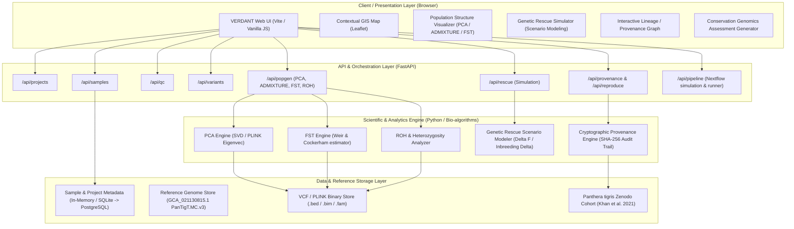

# VERDANT System Architecture

VERDANT is a Conservation Genomics Intelligence platform ("From genomes to conservation decisions") purpose-built for wildlife biologists, conservation geneticists, and protected area managers.

## 1. Architectural Philosophy & Principles

1. **Decoupled Analytics & Scientific Engine**:
   - Scientific calculations and population genomics models are isolated strictly in the backend analytics layer.
   - The frontend is an interface layer consuming typed, structured result objects and never executes statistical or genomic calculations.
2. **Local MVP to Scalable Cloud Migration**:
   - **Local MVP Architecture**: FastAPI (Python 3.12) + Vite / Vanilla JS + In-Memory/SQLite store.
   - **Target Cloud Architecture**: Next.js (App Router), FastAPI microservices, PostgreSQL (with Timescale/JSONB extensions), Google Cloud Storage (for BAM/VCF/FASTQ), Google Cloud Batch / Cloud Run, Nextflow on Kubernetes/GCP Batch, Dockerized container workers.
3. **Data Integrity & Tripartite Labelling**:
   Every data point, sample, and visualization in the platform is explicitly categorized into one of three strict tiers:
   - **REAL DATA**: Verified biological samples, sequencing reads, and metadata directly from published repositories (e.g. Zenodo DOI: `10.5281/zenodo.14258052`, `10.5281/zenodo.15263700`, Khan et al. 2021 PNAS).
   - **REAL ANALYSIS RESULTS**: Deterministic outputs calculated via validated tools (PLINK, BCFtools, SVD, Weir & Cockerham $F_{ST}$) from real data.
   - **SIMULATED DEMONSTRATION DATA**: Clearly watermarked and labelled synthetic scenarios (e.g., hypothetical future translocations, simulated pipeline DAG executions).
   - *Any missing metric strictly displays*: `"Not available in the current dataset."`
4. **First-Class Reproducibility & Cryptographic Provenance**:
   - Every analysis records: Input file URIs & SHA256 checksums, Software tool & exact version, Reference genome assembly & version (`GCA_021130815.1_PanTigT.MC.v3`), Parameter strings, Git commit hashes, Output checksums, and execution logs.
   - Interactive analysis lineage graph from raw FASTQ to conservation assessment.
5. **Scientific Safety & Decision Support**:
   - Strict separation of **OBSERVATION**, **STATISTICAL INTERPRETATION**, and **CONSERVATION CONTEXT**.
   - No automated biological assertions; provides decision support rather than autonomous management directives.

---

## 2. High-Level System Architecture Diagram

---

## 3. Component Details & Migration Path

| Local MVP Component | Local Technology | Production Cloud Target |
| :--- | :--- | :--- |
| **Frontend UI** | Vite + Vanilla JS + HTML5 + CSS3 | Next.js 14+ (React / TypeScript / Tailwind / Shadcn) |
| **Visualizations** | Chart.js + Canvas D3 + Leaflet.js | React-Plotly + D3.js + MapLibre GL |
| **Backend API** | FastAPI (Python 3.12, Uvicorn) | FastAPI on Google Cloud Run |
| **Relational Metadata** | In-Memory Data Registry / SQLite | PostgreSQL 16 on Google Cloud SQL |
| **Genomic Storage** | Local File Store (`demo/tiger/`) | Google Cloud Storage (GCS Multi-Region buckets) |
| **Workflow Pipeline** | Local Nextflow simulator / runner | Nextflow on Google Cloud Batch / Slurm |
| **Worker Queue** | Asyncio Background Tasks | Celery / Redis / Google Cloud Tasks |
