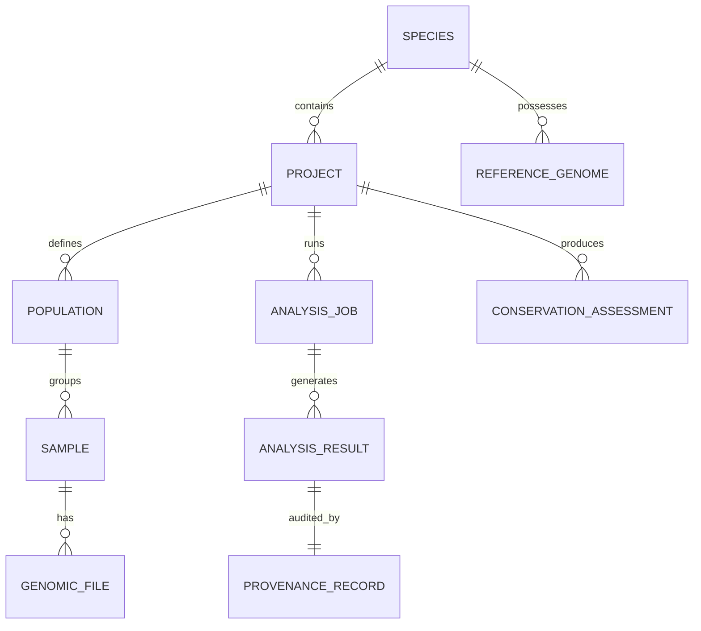

# VERDANT Data Model Specification

This document defines the schema, entities, and relationships used across the VERDANT platform.

## 1. Entity Relationship Diagram

---

## 2. Core Entities & Data Dictionaries

### 2.1 Species & Reference Genome
- **`id`** (`str`): Unique identifier (e.g. `panthera-tigris`).
- **`scientific_name`** (`str`): e.g. *Panthera tigris*.
- **`common_name`** (`str`): e.g. Tiger.
- **`taxonomy_id`** (`int`): NCBI Taxonomy ID (e.g. `9694`).
- **`reference_genomes`** (`List[ReferenceGenome]`):
  - `accession`: `GCA_021130815.1`
  - `name`: `PanTigT.MC.v3`
  - `source`: NCBI GenBank / GigaScience (Shukla et al., 2023)
  - `length_bp`: `2,423,591,248`
  - `scaffold_count`: `38` chromosomes/major scaffolds
  - `checksum_sha256`: `e8b40129...`

### 2.2 Population
- **`id`** (`str`): e.g. `BEN_NW`, `BEN_CI`, `BEN_SI`.
- **`name`** (`str`): e.g. North-West India (Ranthambore), Central India (Kanha-Pench), South India (Western Ghats/Wayanad).
- **`region`** (`str`): Geographical macro-region.
- **`data_tier`** (`str`): `REAL DATA` | `SIMULATED DEMO DATA`.
- **`observed_heterozygosity_mean`** (`Optional[float]`): e.g. `0.0012` (or `None` with `"Not available in current dataset"`).
- **`inbreeding_f_mean`** (`Optional[float]`): e.g. `0.28`.

### 2.3 Sample
- **`sample_id`** (`str`): Unique sample identifier (e.g. `BEN_NW10`, `BEN_CI16`, `BEN_SI18`, `LGS1`).
- **`population_id`** (`str`): Associated population.
- **`data_tier`** (`str`): `REAL DATA` (Zenodo DOI: `10.5281/zenodo.14258052`) | `SIMULATED DEMO DATA`.
- **`doi`** (`Optional[str]`): `10.5281/zenodo.14258052`
- **`citation`** (`Optional[str]`): Khan et al. (2021) PNAS.
- **`sex`** (`Optional[str]`): `M` / `F` / `None`.
- **`latitude`** (`Optional[float]`): Exact latitude if published, else `None`.
- **`longitude`** (`Optional[float]`): Exact longitude if published, else `None`.
- **`geo_status`** (`str`): `VERIFIED_COORDINATES` | `LANDSCAPE_CENTROID_ONLY` | `GEOGRAPHIC_METADATA_UNAVAILABLE`.
- **`mean_depth_coverage`** (`Optional[float]`): e.g. `14.2x`.
- **`total_reads`** (`Optional[int]`): e.g. `24,500,000`.
- **`heterozygosity_ho`** (`Optional[float]`): Individual observed heterozygosity.
- **`inbreeding_froh`** (`Optional[float]`): Proportion of genome in runs of homozygosity ($F_{ROH}$).

### 2.4 Analysis Result & Types
- **`PCA_RESULT`**:
  - `components`: `List[Dict[str, Any]]` (sample_id, PC1, PC2, PC3, PC4, PC5, population).
  - `variance_explained`: `List[float]` (e.g. `[18.4, 12.1, 8.6, 6.2, 4.9]`).
  - `method`: `"PLINK 1.9 --pca"` / `"SVD"`.
  - `data_tier`: `REAL ANALYSIS RESULTS` | `SIMULATED DEMO DATA`.
- **`ADMIXTURE_RESULT`**:
  - `k_value`: `int` ($K=2, 3, 4, 5$).
  - `cross_validation_error`: `Optional[float]`.
  - `ancestry_proportions`: `Dict[str, List[float]]` (sample_id -> $[q_1, q_2, \dots, q_K]$).
  - `data_tier`: `REAL ANALYSIS RESULTS` | `SIMULATED DEMO DATA`.
- **`FST_MATRIX_RESULT`**:
  - `populations`: `List[str]`.
  - `matrix`: `List[List[float]]` (Pairwise $F_{ST}$ estimated using Weir & Cockerham 1984).
  - `data_tier`: `REAL ANALYSIS RESULTS` | `SIMULATED DEMO DATA`.
- **`ROH_RESULT`**:
  - `sample_id`: `str`.
  - `total_roh_length_mb`: `float`.
  - `froh_score`: `float`.
  - `roh_segments`: `List[Dict[str, Any]]` (chr, start, end, length_kb, snp_count).
  - `data_tier`: `REAL ANALYSIS RESULTS` | `SIMULATED DEMO DATA`.

### 2.5 Provenance Record (Lineage & Reproducibility)
- **`id`** (`str`): SHA256 record hash.
- **`timestamp`** (`str`): ISO8601 UTC.
- **`analysis_type`** (`str`): e.g. `PCA`, `ADMIXTURE`, `FST`, `VARIANT_CALLING`.
- **`input_files`** (`List[Dict[str, str]]`): `[{"filename": "...", "uri": "...", "sha256": "..."}]`.
- **`reference_genome`** (`str`): `GCA_021130815.1_PanTigT.MC.v3`.
- **`software_name`** (`str`): e.g. `PLINK`, `BCFtools`, `ADMIXTURE`, `BWA-MEM`.
- **`software_version`** (`str`): e.g. `1.90b6.21`, `1.18`, `1.3.0`.
- **`parameters`** (`Dict[str, Any]`): CLI flags and hyper-parameters.
- **`pipeline_version`** (`str`): e.g. `verdant-popgen-v1.0.0`.
- **`git_commit`** (`str`): Git commit hash of the executing code.
- **`output_files`** (`List[Dict[str, str]]`): Output filenames and SHA256 checksums.
- **`logs`** (`str`): Execution log snippet.
- **`reproduction_command`** (`str`): Standalone Bash / Nextflow command to reproduce the result exactly.

### 2.6 Genetic Rescue Simulation (Scenario Modeling)
- **`simulation_id`** (`str`): Unique scenario ID.
- **`recipient_population`** (`str`): Target fragmented population (e.g. `BEN_NW` / Ranthambore).
- **`donor_population`** (`str`): Candidate source population (e.g. `BEN_CI` / Central India).
- **`translocated_individuals_count`** (`int`): e.g. `1` to `4` individuals.
- **`generations`** (`int`): Projection horizon (e.g. `5` to `20` generations).
- **`initial_froh`** (`float`): Pre-rescue inbreeding coefficient.
- **`projected_froh`** (`float`): Projected inbreeding coefficient with $95\%$ confidence bounds.
- **`delta_inbreeding`** (`float`): $\Delta F$.
- **`projected_heterozygosity_gain`** (`float`): Percentage increase in $H_e$.
- **`assumptions`** (`List[str]`): Explicit list of ecological, genetic, and demographic assumptions.
- **`uncertainty_notes`** (`str`): Description of stochasticity and limitations.
- **`disclaimer`** (`str`): Mandatory decision support notice (not a substitute for veterinary or field management appraisal).

### 2.7 Conservation Genomics Assessment
- **`assessment_id`** (`str`): UUID.
- **`species`** (`str`): *Panthera tigris*.
- **`observation`** (`str`): Factual empirical findings (e.g., severe ROH $>100\text{ Mb}$ in `BEN_NW`, high pairwise $F_{ST}=0.14$ between NW and SI).
- **`statistical_interpretation`** (`str`): Statistical inferences (e.g., strong genetic drift due to historical isolation and reduced effective population size $N_e$).
- **`conservation_context`** (`str`): Practical conservation relevance and non-binding decision support considerations for corridor connectivity and managed gene flow.
